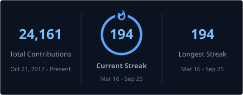

### Hi, I'm WisdomToNorth

Software engineer building local-first tools and shared workspace infrastructure across C++, Qt/QML, Swift, Python, and mixed stacks.

**What I work on**

- **[FreeCM](https://github.com/NorthBoundWisdom/FreeCM)** — Shared source-root and workflow infrastructure for large multi-repository workspaces.
- **[Ravo](https://github.com/NorthBoundWisdom/Ravo)** — A photo library and RAW editor rebuilt for local photography workflows.
- **[GeoControls](https://github.com/NorthBoundWisdom/GeoControls)** — Reusable Qt/QML controls and application-shell components.

**Stack**

`C++` · `Qt / QML` · `Python` · `Swift` · `CMake` · `C# / .NET` · `Android`

  <picture>
    <source media="(prefers-color-scheme: dark)" srcset="https://github-readme-stats.shion.dev/api?username=NorthBoundWisdom&show_icons=true&theme=dracula&hide_border=true">
    <source media="(prefers-color-scheme: light)" srcset="https://github-readme-stats.shion.dev/api?username=NorthBoundWisdom&show_icons=true&theme=default&hide_border=true">
    
  </picture>
  <picture>
    <source media="(prefers-color-scheme: dark)" srcset="https://github-readme-stats.shion.dev/api/top-langs/?username=NorthBoundWisdom&layout=compact&theme=dracula&hide_border=true&exclude_repo=NorthBoundWisdom,rawspeed,freetype,CavalierContours,CavalierContoursDev">
    <source media="(prefers-color-scheme: light)" srcset="https://github-readme-stats.shion.dev/api/top-langs/?username=NorthBoundWisdom&layout=compact&theme=default&hide_border=true&exclude_repo=NorthBoundWisdom,rawspeed,freetype,CavalierContours,CavalierContoursDev">
    
  </picture>

  

